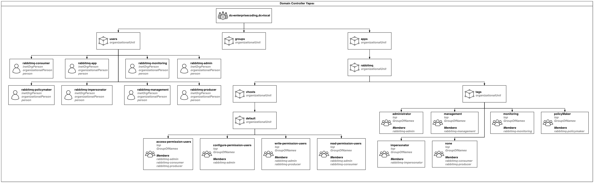

# Ortam

Sizin adınıza lab ortamına RabbitMQ ve yönetim eklentisi kurulmuştur. LDAP entegrasyonu amacıyla bir LDAP sunucusu konumlandırılmıştır. LDAP sunucu aşağıdaki şekilde yapılandırılmıştır;



Tüm kullanıcılar `enterprisecoding`{{copy}} şifresi ile tanımlanmıştır.

Bu lab'da RabbitMQ ile LDAP entegrasyonu gerçekleştireceksiniz. Senaryo gereği **users** organizasyon birimi altındaki tüm kullanıcılar RabbitMQ'ya giriş yapabilir. Kullanıcının bir vhost'a erişebilmesi için **app** => **rabbitmq** => **vhosts** altındaki ilgili vhost'a ait organizasyon birimi altında yer alan **access-permission-users** grubu içerisinde yer alması beklenmektedir.

Kullanıcıların vhost altında yapabilecekleri olarak ilgili **vhost** organizasyon birimi altındaki **configure-permission-users**, **write-permission-users** ve **read-permission-users** gruplarında yer almasına göre şekillenecektir.

Kullanıcı tag'i **app** => **rabbitmq** => **tags** altındaki ilgili gruptaki üyeliği belirlenecektir.
# LDAP Eklentisi Kurulumu

LDAP bağlantısı için gerekli erlang modülünü aşağıdaki komutla kurun;

`sudo apt-get install -y erlang-eldap`{{execute}}

Aşağıdaki komutla RabbitMQ LDAP eklentisini kurunİ

`rabbitmq-plugins enable rabbitmq_auth_backend_ldap`{{execute}}

Aşağıdaki komutla RabbitMQ'yu yetkilendirmede öncelikle LDAP, ardından da iç veritabanı kullanıcılarını yetkilendirecek şekilde yapılandırın;

```bash
cat > /etc/rabbitmq/advanced.config <<EOF
[
  {rabbit, [{auth_backends, [rabbit_auth_backend_ldap, rabbit_auth_backend_internal]}]},
  {rabbitmq_auth_backend_ldap,
   [ 
        {servers,               ["127.0.0.1"]},
        {dn_lookup_base,        "ou=users,dc=enterprisecoding,dc=local"},
        {user_dn_pattern,       "cn=\${username},ou=users,dc=enterprisecoding,dc=local"},
        {other_bind,            {"cn=rabbitmq-app,ou=users,dc=enterprisecoding,dc=local","enterprisecoding"}},

        {vhost_access_query,    {in_group, "cn=access-permission-users,ou=\${vhost},ou=vhosts,ou=rabbitmq,ou=app,dc=enterprisecoding,dc=local"}},
        {resource_access_query, {for, 
            [
                {permission, configure, {in_group, "cn=configure-permission-users,ou=\${vhost},ou=vhosts,ou=rabbitmq,ou=app,dc=enterprisecoding,dc=local"}},
                {permission, write, {in_group, "cn=write-permission-users,ou=\${vhost},ou=vhosts,ou=rabbitmq,ou=app,dc=enterprisecoding,dc=local"}},
                {permission, read, {in_group, "cn=read-permission-users,ou=\${vhost},ou=vhosts,ou=rabbitmq,ou=app,dc=enterprisecoding,dc=local"}}
            ]
        }},
        {tag_queries, 
            [
                {administrator, {in_group, "cn=administrator,ou=tags,ou=rabbitmq,ou=app,dc=enterprisecoding,dc=local"}},
                {management, {in_group, "cn=management,ou=tags,ou=rabbitmq,ou=app,dc=enterprisecoding,dc=local"}}
            ]
        },

        {use_ssl,               false},
        {port,                  389},
        {log,                   false} 
    ]}
].
EOF
```{{execute}}

Değişikliklerin devreye girmesi için RabbitMQ'yu yeniden başlatın;

`rabbitmqctl stop_app`{{execute}}
`rabbitmqctl start_app`{{execute}}

**Continue** butonuna basarak sıradaki adıma geçebilirsiniz.